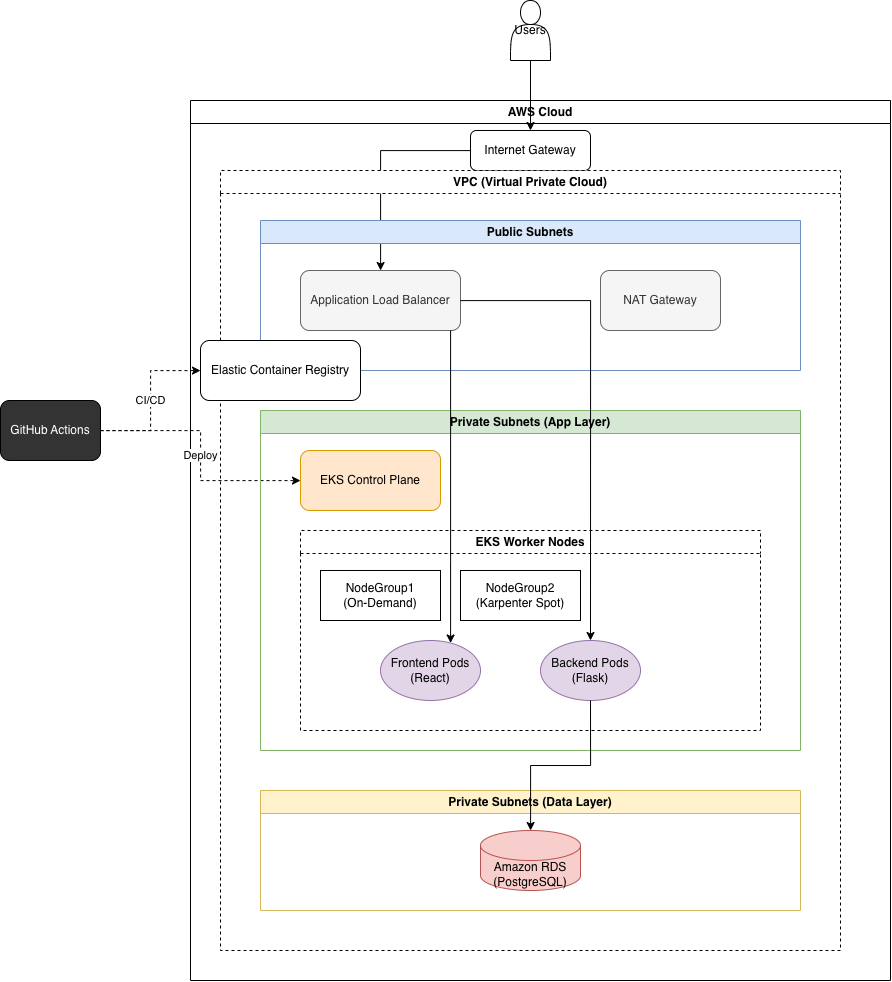

# EKS + Karpenter Terraform Project

This repository contains Terraform code to provision an Amazon EKS cluster with Karpenter auto-scaling.

## Prerequisites

Ensure you have the following tools installed:

*   [AWS CLI](https://docs.aws.amazon.com/cli/latest/userguide/getting-started-install.html) (configured with credentials)
*   [Terraform](https://developer.hashicorp.com/terraform/install) (v1.0+)
*   [kubectl](https://kubernetes.io/docs/tasks/tools/)
*   [helm](https://helm.sh/docs/intro/install/)

## Deployment Steps

### 1. Initialize Terraform
Initialize the project to download providers and modules.
```bash
terraform init
```

### 2. Apply Configuration
Create the infrastructure (VPC, EKS, IAM Roles, Karpenter).
```bash
terraform apply
```
Review the plan and type `yes` to confirm.

### 3. Configure kubectl
Update your kubeconfig to interact with the new cluster.
```bash
aws eks update-kubeconfig --region eu-central-1 --name EKS-Cluster
```

## Verification

### Check Nodes
Verify that the initial system nodes are ready.
```bash
kubectl get nodes
```

### Check Karpenter Status
Ensure the Karpenter controller is running.
```bash
kubectl get pods -n karpenter
```
Check Karpenter logs to ensure it's listening.
```bash
kubectl logs -n karpenter -l app.kubernetes.io/name=karpenter
```

### Test Auto-scaling
Deploy a sample application that requests resources, triggering Karpenter to provision new nodes.

1.  **Apply the inflate deployment**:
    ```bash
    kubectl apply -f inflate.yaml
    ```
    This deployment has 0 replicas initially.

2.  **Scale it up**:
    ```bash
    kubectl scale deployment inflate --replicas=3
    ```
    Each pod requests 1 CPU. Since the existing node cannot hold 3 pods (plus system pods), Karpenter will provision new generic Spot nodes (arm64/amd64 as configured).

3.  **Watch nodes provision**:
    ```bash
    kubectl get nodes -w
    ```
    You should see new nodes being added by Karpenter to handle the pending pods.

4.  **Cleanup test**:
    ```bash
    kubectl delete deployment inflate
    ```

## Cleanup

To tear down all infrastructure:
```bash
terraform destroy
```
-----------


# Innovate Inc. Cloud Infrastructure Architecture Design

## 1. Executive Summary

This document outlines the proposed cloud infrastructure for Innovate Inc.'s new web application. The solution prioritizes **scalability**, **security**, and **cost-effectiveness** by leveraging **Amazon Web Services (AWS)**. The core of the architecture is built around **Amazon EKS (Elastic Kubernetes Service)** for container orchestration and **Amazon RDS** for managed database services.

## 2. Cloud Environment Structure

**Provider Choice:** **AWS (Amazon Web Services)**.
**Justification:** AWS is the market leader with the most mature ecosystem for managed Kubernetes (EKS) and database services. Given the anticipated rapid growth, AWS provides the widest range of services to scale (e.g., Karpenter for intelligent provision, Spot instances). It also aligns with the Terraform context established in related projects.

### Organization & Account Strategy
To ensure security, billing isolation, and ease of management, we recommend a multi-account strategy using **AWS Organizations**:

1.  **Management Account**: For consolidated billing and high-level governance (SCP).
2.  **Security/Log Archive Account**: Centralized CloudTrail logs and security auditing tools.
3.  **Shared Services Account**: CI/CD runners, ECR (Container Registry), and central tooling.
4.  **Workloads - Staging**: A mirror of production for testing. Use smaller instances/clusters to save costs.
5.  **Workloads - Production**: The live environment with full redundancy and higher resource limits.

## 3. Network Design

### Virtual Private Cloud (VPC)
We will design a standard 3-tier VPC architecture for maximum security and availability.

*   **CIDR Block**: `/16` (e.g., 10.0.0.0/16) to allow ample IP space for node scaling.
*   **Availability Zones (AZs)**: 3 AZs for High Availability (HA).

### Subnet Strategy
1.  **Public Subnets (Tier 1)**:
    *   Resources: Application Load Balancers (ALB), NAT Gateways, Bastion Hosts (if needed).
    *   Access: Direct Internet access via Internet Gateway (IGW).
2.  **Private Subnets - App (Tier 2)**:
    *   Resources: EKS Worker Nodes, operational pods.
    *   Access: No direct internet ingress. Egress via NAT Gateway for pulling images/updates.
3.  **Private Subnets - Data (Tier 3)**:
    *   Resources: Amazon RDS instances, ElastiCache (if added later).
    *   Access: Restricted strictly to traffic from Tier 2 subnets.

### Network Security
*   **Security Groups**: applied at the instance/ENI level (e.g., "Allow TCP 5432 only from App Security Group" for RDS).
*   **NACLs (Network ACLs)**: Stateless packet filtering for subnet-level boundary protection.
*   **WAF (Web Application Firewall)**: Attached to the ALB to protect against common web exploits (SQL injection, XSS).

## 4. Compute Platform (Kubernetes)

### Amazon EKS (Elastic Kubernetes Service)
EKS handles the heavy lifting of the Kubernetes control plane.

### Node Groups & Scaling
1.  **Managed Node Groups (On-Demand)**:
    *   Purpose: Run critical system pods (CoreDNS, VPC CNI, Metrics Server) and baseline application replicas.
    *   Benefit: Stability and guaranteed availability.
2.  **Karpenter (Auto-scaling)**:
    *   Purpose: Rapidly provision nodes for application workloads.
    *   Strategy: Use **Spot Instances** for stateless application pods to reduce compute costs by up to 90%. Karpenter will dynamically select the best instance types based on pending pod requirements.

### Containerization & Deployment
*   **Image Building**: Dockerfiles for Python/Flask (Backend) and React (Frontend). Frontend connects to Backend via internal service DNS or Ingress path routing.
*   **Registry**: **Amazon ECR** (Elastic Container Registry) with lifecycle policies to clean up old tags.
*   **CI/CD**: GitHub Actions or AWS CodePipeline.
    1.  Code Commit -> Trigger Build.
    2.  Build Docker Image -> Push to ECR with unique SHA tag.
    3.  Update Helm Chart/Manifest -> Apply to EKS (Staging first, then Prod).

## 5. Database Service

### Amazon RDS for PostgreSQL
**Recommendation**: **Managed Amazon RDS using the Aurora engine (PostgreSQL compatible)** or **Standard RDS** if cost is the primary constraint initially.
**Justification**: Aurora offers superior performance and auto-scaling storage compared to standard RDS, which is ideal for "rapid growth to millions of users."

### High Availability & Disaster Recovery (DR)
*   **Multi-AZ Deployment**: Automatically provisions a synchronous standby replica in a different AZ. If the primary fails, RDS fails over automatically.
*   **Backups**:
    *   **Automated Backups**: Retention set to 7-35 days for Point-in-Time Recovery (PITR).
    *   **Snapshots**: Manual snapshots before major schema changes.
*   **Encryption**: storage encrypted at rest using KMS; SSL/TLS for data in transit.

## 6. Diagram

Please see `innovate_inc_diagram.png` for the High-Level Visual representation.


